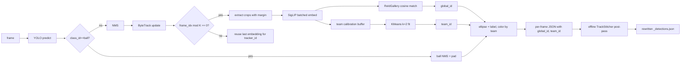

# Player ReID + Team Clustering

## Goals

1. **Persistent identity** — each player gets a `global_id` that survives ByteTrack ID switches, occlusions, leaving frame, and being subbed back in.
2. **Team clustering** — cluster `player` (and optionally `goalkeeper`) detections into two teams via KMeans(k=2) on jersey-bearing embeddings; annotate with team-specific colors.
3. **Backwards compatible** — JSON additions are nullable; existing eval, SoccerNet benchmark, and `model_only` mode keep working.
4. Out of scope (per user): using embeddings to recover YOLO-missed detections (follow-up).

## Pipeline

## Embedding backbone

Default to **SigLIP** (`google/siglip-base-patch16-224`) loaded once via `transformers` — same backbone Roboflow Sports uses for soccer team classification, very strong for jersey-driven separation. Provide an `OSNet` alternative (lighter, person-ReID specific) and a `MockBackbone` for tests. Crops are padded by ~10% to include shoulders/legs since jersey + shorts drive both ReID and team signal.

Cosine similarity in L2-normalized space, EMA-updated gallery template per `global_id` (default decay 0.9). Greedy match per frame, then a Hungarian fallback when ≥2 candidates compete for the same gallery entry above threshold.

## Files

### New: [src/inference/reid.py](src/inference/reid.py)

- `EmbeddingBackbone` protocol with `embed(crops: list[np.ndarray]) -> np.ndarray` (L2-normalized, shape `(N, D)`).
- `SigLIPBackbone`, `OSNetBackbone`, `MockBackbone` implementations.
- `extract_crops(frame, xyxy, pad_ratio=0.1)` with edge clamping (boxes near borders are common).
- `ReIdGallery`:
  - state: `dict[int, GalleryEntry]` where entry = `(ema_embedding, last_seen_frame, sample_count, team_id, tracker_id_history)`
  - `match_and_update(embeddings, tracker_ids, frame_idx, sim_threshold=0.78, max_age_frames=900)` → returns `list[int]` of global IDs aligned to input.

### New: [src/inference/team_classifier.py](src/inference/team_classifier.py)

- `TeamClassifier`:
  - `collect(embeddings, class_ids)` — buffers only `player` embeddings (canonical id 2 → shifted id 1) during calibration window.
  - `fit()` — `sklearn.cluster.KMeans(n_clusters=2, n_init=10)` on accumulated buffer; stores `cluster_centers`_. Optional `umap-learn` reduction toggle (off by default).
  - `predict(embeddings)` → `np.ndarray[int]` in `{0, 1}`.
  - `is_fitted` property; before fit, callers fall back to `team_id = None`.
- Goalkeeper: try classifier prediction; if its embedding is far from both centers (max cosine to either center below `team_classifier_sim_threshold`), set `team_id = None`.

### New: [src/inference/track_stitcher.py](src/inference/track_stitcher.py)

- `stitch_tracks(per_tracker_embeddings: dict[int, list[np.ndarray]], per_tracker_frames: dict[int, tuple[int,int]], sim_threshold=0.82, allow_overlap_frames=2)`:
  - Compute mean embedding per tracker_id.
  - Build edges between tracker IDs whose mean embedding cosine ≥ threshold AND whose temporal extents do not overlap by more than `allow_overlap_frames` (so two players visible simultaneously aren't merged).
  - Union-find → `dict[int, int]` mapping `tracker_id → stitched_global_id`.

### Modify: [src/inference/video_processor.py](src/inference/video_processor.py)

- Extend `AnnotatorConfig` with `team_a_color`, `team_b_color`, `goalkeeper_color`, `referee_color`, `unknown_team_color` (hex). Defaults preserve current palette behavior when ReID is off.
- Extend `VideoProcessor.__init`__ with: `enable_reid=False`, `reid_backbone="siglip"`, `reid_interval=5`, `reid_sim_threshold=0.78`, `reid_max_age_frames=900`, `team_calibration_frames=200`, `enable_offline_stitch=True`.
- When `enable_reid`:
  - Build backbone, `ReIdGallery`, `TeamClassifier` lazily on first use.
  - In `process_frame`, after the existing ByteTrack update at line 129, every `reid_interval` frames extract crops for non-ball tracked detections, embed in one batch, call `gallery.match_and_update`, and update the team classifier buffer / predict team IDs.
  - Cache last-known `global_id` and `team_id` per `tracker_id` between embedding frames so non-embedding frames still annotate consistently.
  - Replace label `f"#{int(tid)}"` (line 131) with `f"#{int(global_id)}"` and pass per-detection colors derived from `team_id` + `class_id`.
- In `process_video`:
  - Build `per_tracker_embeddings` and `per_tracker_frames` while streaming.
  - After the loop, if `enable_offline_stitch`, run `stitch_tracks`, rewrite `global_id` for every entry in `all_detections`, then re-predict `team_id` on each stitched group's mean embedding for stability.
- `_extract_detection_data`: add nullable `global_id` and `team_id` fields to each `tracked_objects` entry. Ball entry unchanged. Schema is additive — old consumers ignore new keys.

### Modify: [inference.py](inference.py)

Add CLI flags mirroring the new constructor args: `--reid`, `--reid-backbone {siglip,osnet}`, `--reid-interval`, `--reid-sim-threshold`, `--team-calibration-frames`, `--no-offline-stitch`, `--team-a-color`, `--team-b-color`, `--goalkeeper-color`, `--referee-color`. Wire into `AnnotatorConfig` and `VideoProcessor`.

### Modify: [src/eval/schema.py](src/eval/schema.py)

- Extend the prediction loader (`boxes_from_pred_frame`) to read optional `global_id` / `team_id` per `tracked_object` and attach them to `Box`. Existing eval behavior unchanged when fields are missing.

### New: [src/eval/reid.py](src/eval/reid.py)

- `evaluate_reid_consistency(pred_by_frame, gt_by_frame)` → dict with:
  - `reid_idf1` — IDF1 using `global_id` instead of `tracker_id` (reuse the existing TrackEval wiring from `src/eval/tracking.py` so we don't reinvent the metric).
  - `id_switches_global`
  - `mean_global_track_length_frames`
  - `team_purity` — per GT person track, fraction of frames where the modal predicted `team_id` matches.
- Wire into `src/eval/runner.py::build_report` under a new `"reid"` block when `run_tracking=True` and any prediction frame carries `global_id`.

### Modify: [scripts/soccer_net_benchmark.py](scripts/soccer_net_benchmark.py)

Add pass-through `--reid` and `--no-offline-stitch` flags so SoccerNet runs can A/B baseline vs. ReID. Resulting `eval_report.json` will surface the new `reid` block automatically via `build_report`.

### Dependencies

- [requirements.txt](requirements.txt): add `transformers>=4.40`, `Pillow>=10`, `scikit-learn>=1.4`, optionally `umap-learn>=0.5`. (`torch` already pulled by `ultralytics`.)
- [requirements-optional.txt](requirements-optional.txt): unchanged (this is core inference).
- [requirements-ci.txt](requirements-ci.txt): unchanged — tests use `MockBackbone`.

## Defaults and rationale

- `reid_interval = 5` — at 25 fps that's ~5 Hz, plenty for ID stability without dominating runtime; SigLIP-base on a single GPU does ~50 ms / batch of 22 crops.
- `sim_threshold = 0.78` (online), `0.82` (stitcher) — stitcher is stricter because it merges across long gaps where the cost of a wrong merge is higher.
- `team_calibration_frames = 200` — usually enough non-occluded player crops to give KMeans a clean two-cluster signal even before kickoff finishes.
- `max_age_frames = 900` — ~36 s at 25 fps; covers typical sub windows but not full halves.
- Default backbone `siglip` since the user explicitly cares about jersey-color separability and SigLIP is the standard choice for soccer team classification.

## Tests ([tests/](tests/))

- `tests/test_reid.py`: deterministic `MockBackbone` confirms gallery reuses ID across frames, creates a new ID when similarity drops below threshold, ages out stale IDs; `extract_crops` clamps boxes that touch image edges.
- `tests/test_team_classifier.py`: two synthetic embedding clusters → `TeamClassifier.fit` recovers correct partition; pre-fit `predict` raises or returns `None` per design.
- `tests/test_track_stitcher.py`: two non-overlapping tracker IDs with similar mean embeddings get stitched; two temporally overlapping ones do not.
- `tests/test_video_processor_reid.py`: monkeypatch the backbone to `MockBackbone` and YOLO to a stub; run `process_video` on a tiny synthetic video and assert each `tracked_objects` entry has `global_id`/`team_id` and JSON round-trips cleanly.
- `tests/test_eval_reid.py`: predictions where `global_id == gt_track_id` → `reid_idf1 ≈ 1.0`, `team_purity == 1.0`; perturbed IDs → metrics degrade as expected.

## Validation

- Run `./scripts/ci_local.sh` (lint + types + tests) before merge per [.cursor/rules/merge-gate-main.mdc](.cursor/rules/merge-gate-main.mdc).
- Quick visual smoke: `python inference.py --reid --json-only ...` on `testing/sn_smoke_e2e/clip.mp4` and inspect that two color clusters dominate and `global_id` reuse holds across a few seconds of occlusion.
- SoccerNet A/B: `python scripts/soccer_net_benchmark.py --reid` vs. baseline, compare `reid_idf1`, `id_switches_global`, and existing `mAP_0.50` (which should be unchanged — ReID never edits boxes in this PR).

